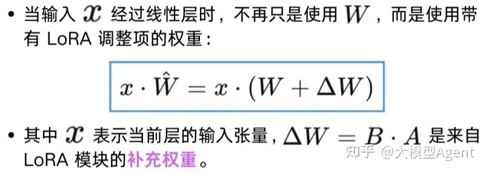

# LoRA (Low-Rank Adaptation 低秩适应)

## LoRA 优势

- 计算资源需求低
- 性能接近全量参数微调
- 模块小巧，部署灵活，即插即用

## LoRA 原理

LoRA 的核心思想是：在不修改模型参数的情况下，通过添加一个额外的可训练模块，对模型行为进行小范围、有针对性的调整。

LoRA 的工作机制包括两个核心阶段

微调阶段: 仅对低秩矩阵进行参数调整在大模型中，像注意力层的权重矩阵通常规模很大。如果直接对这些矩阵进行微调，不仅计算开销大，还容易破坏原有能力。

推理阶段：在计算时叠加 LORA 模块

这样一来：模型的核心结构不变，仍然使用原始训练好的参数。LORA 模块则在不干扰主干的前提下，对最终输出产生影响。整体就像给模型“加了一个外接调节器”，使其在推理时输出更加贴合任务需求。