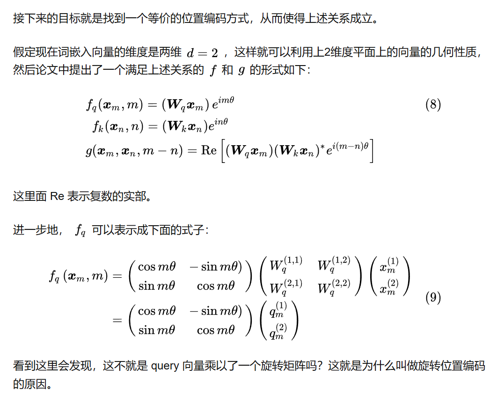
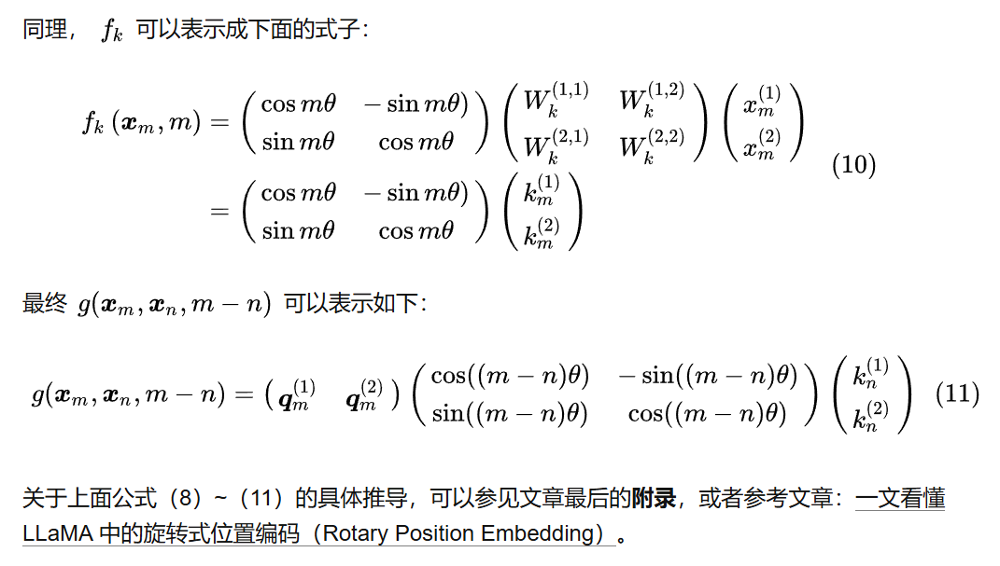
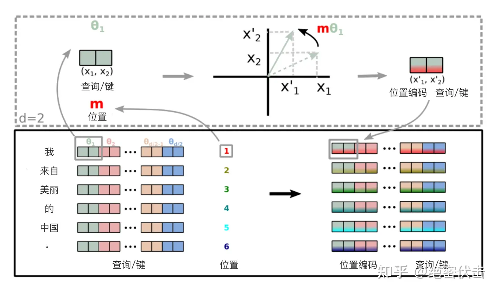

# RoPE (Rotary Position Embedding 旋转编码)

在做 self-attention 之前，会用词嵌入向量计算 q, k, v 向量同时加入位置信息

## 绝对位置编码

对于位置编码，常规的做法是在计算 query, key 和 value 向量之前，会计算一个位置编码向量 p_i 加到词嵌入 x_i 上，位置编码向量 x_i 同样也是 d 维向量，然后再乘以对应的变换矩阵

$f_{t:t\in\{q, k, v\}}(x_{i}, i) := W_{t:t\in\{q, k, v\}}(x_{i} + p_{i})$

而经典的位置编码向量 $P_{i}$ 的计算方式是使用 Sinusoidal (正弦) 函数

$P_{i, 2t} = sin(i / 10000^{2t/d})$

$P_{i, 2t+1} = cos(i / 10000^{2t/d})$

其中 $P_{i, 2t}$ 表示位置 $d$ 维度向量 $P_{i}$ 中的第 $2t$ 位置分量也就是偶数索引位置的计算公式，$P_{i, 2t+1}$ 表示位置 d 维度向量 $P_{i}$ 中的第 $2t+1$ 位置分量也就是奇数索引位置的计算公式。

## 2 维旋转位置编码

为了能利用上 token 之间的相对位置信息，假定 query 向量 $q_{m}$ 和 key 向量 $k_{n}$ 之间的内积操作可以被一个函数 $g$ 表示，该函数 $g$ 的输入是词嵌入向量 $x_{m}$，$x_{n}$ 和它们之间的相对位置$m - n$ ：

$\langle f_{q}(x_{m}, m), f_{k}(x_{n}, n) \rangle = g(x_{m}, x_{n}, m - n)$

总结来说，RoPE 的 self-attention 操作的流程是：对于 token 序列中的每个词嵌入向量，首先计算其对应的 query 和 key 向量，然后对每个 token 位置都计算对应的旋转位置编码，接着对每个 token 位置的 query 和 key 向量的元素按照两两一组应用旋转变换，最后再计算 query 和 key 之间的内积得到 self-attention 的计算结果。

旋转变换过程的直观展示

